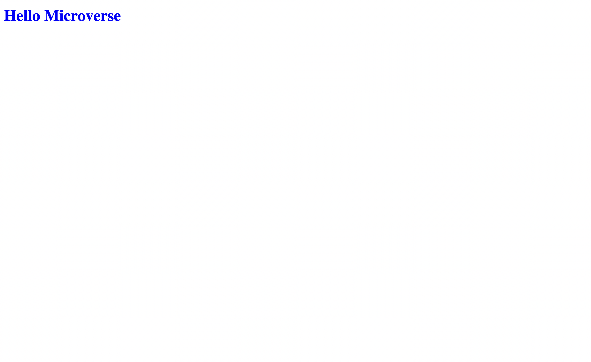

# Hello-world

> This project is my first ever on microverse and its a linter setup as well as a hello world

This is a simple hello world project

## Built With

- HTML
- CSS

## Live Demo

[Live Demo Link](https://bereketretta.github.io/MicroverseHelloWorld/) 

## Getting Started

you can clone and play around 
you can clone the app with git clone https://github.com/BereketRetta/MicroverseHelloWorld.git

## Authors

👤 **Author1**

- GitHub: [@bereketretta](https://github.com/BereketRetta)
- Twitter: [@bekiopia](https://twitter.com/bekiopia)
- LinkedIn: [Bereket Retta](https://linkedin.com/in/bereketretta)

## 🤝 Contributing

Contributions, issues, and feature requests are welcome!

Feel free to check the [issues](https://github.com/BereketRetta/MicroverseHelloWorld/issues).

## Show your support

Give a ⭐️ if you like this project!

## Acknowledgments

- Microverse

## 📝 License

This project is [MIT](./LICENCE) licensed.